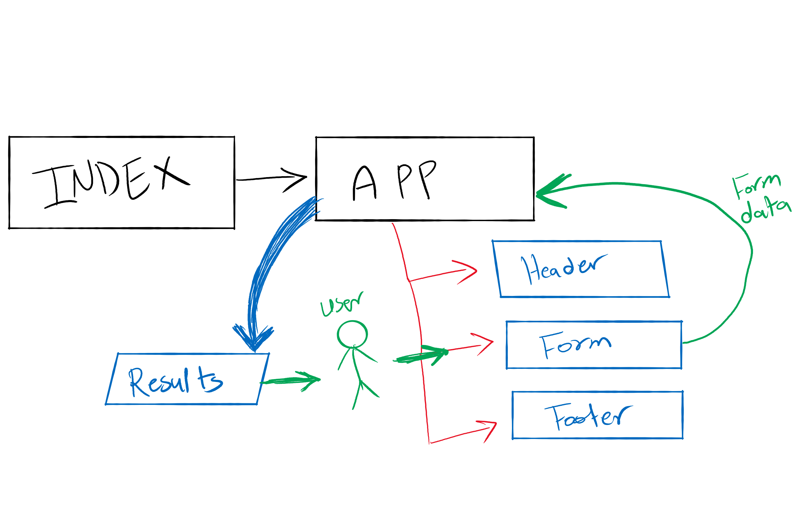

# LAB - Class 27

## Project: RESTy

### Author: Student/Group Name

### Links and Resources

- [submission PR](https://github.com/diana96alazzam-401-advanced-javascript/resty/pull/1/)

- [RE-submission PR](https://github.com/diana96alazzam-401-advanced-javascript/resty/pull/13/)

<!-- - [ci/cd](http://xyz.com) (GitHub Actions) 
- [back-end server url](http://xyz.com) (when applicable) -->
- [front-end application](https://sharp-poincare-46f5f6.netlify.app/) (netlify)
- **Doesn't work for now but I tested before** [front-end application](https://diana96alazzam-401-advanced-javascript.github.io/resty/) (github)

#### How to initialize/run this application

- `npm start`

#### Tests

- npm test

#### UML

