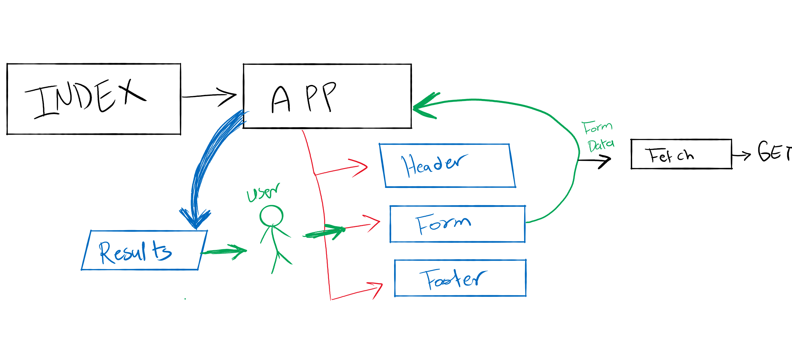

# LAB - Class 28

## Project: RESTy

### Author: Student/Group Name

### Links and Resources

- [submission PR](https://github.com/diana96alazzam-401-advanced-javascript/resty/pull/10)
<!-- - [ci/cd](http://xyz.com) (GitHub Actions) 
- [back-end server url](http://xyz.com) (when applicable)  -->
- [front-end application-netlify](https://quirky-hoover-84b857.netlify.app/) 
- [front-end application-github-pages](https://diana96alazzam-401-advanced-javascript.github.io/resty/) 

#### How to initialize/run this application

- `npm start` and it will redirect you to `http://localhost:3000/diana96alazzam-401-advanced-javascript.github.io/resty`

#### How to initialize/run this application

- `npm start`

#### UML

