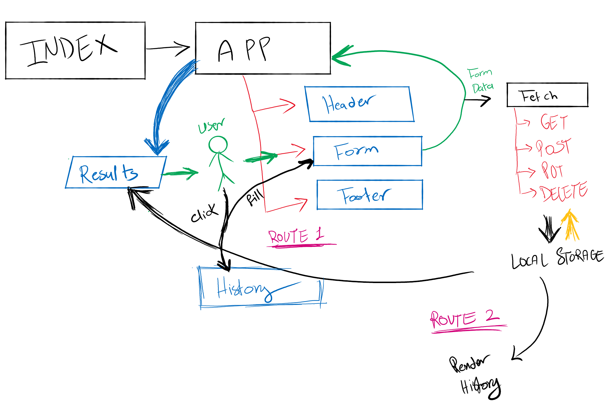

## Project: RESTy

### Author: Student/Group Name

### Links and Resources

- [submission PR](https://github.com/diana96alazzam-401-advanced-javascript/resty/pull/12)
<!-- - [ci/cd](http://xyz.com) (GitHub Actions) 
- [back-end server url](http://xyz.com) (when applicable)  -->
- [front-end application-netlify](https://priceless-swirles-872b5b.netlify.app/) 

### Notes: 
 - BUG: The history will show in the first page but when you click it it will change the value of the test input but doesn't show it in the form.

### Setup

- `npm install`

#### How to initialize/run this application

- `npm start` and it will redirect you to `http://localhost:3000/resty`

#### Tests

- npm test

#### UML

